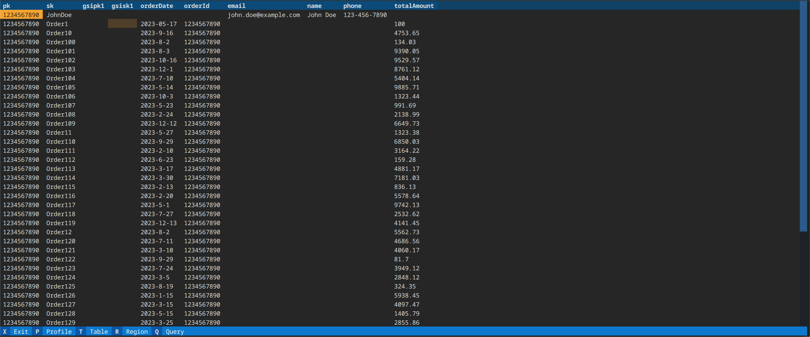

# dyno-viewer

dyno-viewer is dynamodb table viewer for your terminal build using [textual](https://github.com/Textualize/textual). 

This came out from me being frustrated with how clunky and slow the dynamodb viewier is in the aws console and me finding no good alternative.


## installing

### prerequisites

you need the [aws cli](https://aws.amazon.com/cli/) fully configured (see [here](https://docs.aws.amazon.com/cli/latest/userguide/cli-chap-authentication.html) for how to setup up auth) 

#### note about AWS IAM Identity Center(used to be called aws sso) aws profiles:

if you are using sso profiles. Then you need to make sure that you have updated your config to use a sso-session profile otherwise the app won't work see this [doc](https://docs.aws.amazon.com/cli/latest/userguide/sso-configure-profile-token.html) on how to do that. See this issue: https://github.com/boto/botocore/issues/2374 if you want to know why this is the case 

right now this can be installed via flatpak and pip:

### via pip 

```bash
pip install dyno-viewer
```

### via flatpak

There is a bundled .flatpak file that get generated on release which can be installed via:

```bash
flatpak install <bundled .flatpak filename>
```

## dev notes

### prerequisites

this repo uses [poetry](https://python-poetry.org/docs/) for package management and needs python 3.10.7 installed either via [pyenv](https://github.com/pyenv/pyenv)
or [asdf](https://asdf-vm.com/) using the [asdf-community/asdf-python](https://github.com/asdf-community/asdf-python) addon


```bash
env PYTHON_CONFIGURE_OPTS="--enable-shared" asdf install python 3.10.7
```
or if using pyenv:

```bash
env PYTHON_CONFIGURE_OPTS="--enable-shared" pyenv install 3.10.7
```

see [how to build cpython with --enable-shared](https://github.com/pyenv/pyenv/wiki#how-to-build-cpython-with---enable-shared) for more info

#### note about AWS IAM Identity Center(used to be called aws sso) aws profiles

if you are using sso profiles. Then you need to make sure that you have updated your config to use a sso-session profile otherwise the app won't work see this [doc](https://docs.aws.amazon.com/cli/latest/userguide/sso-configure-profile-token.html) on how to do that. See this issue: https://github.com/boto/botocore/issues/2374 if you want to know why this is the case 

### local dev setup

to install locally run:
```bash
poetry install
# to go into a virtual env shell 
poetry shell
# or run app via script
poetry run run_app
```


### flatpak notes

this repo supports local flatpak building to make the process easy there is a script that builds the flatpak, Which are loosely created from this really useful [blog post](https://www.loganasherjones.com/2018/05/using-flatpak-with-python/). To run call:

```bash
poetry run flatpak_build
```

This will export the main packages into a requirements file and then build flatpak in the `.flatpak` folder then export that flatpak to a binary file in root called `dyno-viewer.flatpak` which can be installed on another computer via `flatpak install dyno-viewer.flatpak`

It also has support for doing other different options via arguments:

#### install locally

``` bash
poetry run flatpak_build -i 
```

This will install the flatpak locally instead of exporting it to a file (Useful for dev testing), Which then you can run it via:

```bash
flatpak run org.flatpak.dyno-viewer
```

#### gpg key support

You can pass a gpg key for signing a flatpak, Which is best practice (see more on that [here](https://docs.flatpak.org/en/latest/flatpak-builder.html#signing)) via:

```bash
poetry run flatpak_build --gpg "<key id>"
```

If the gpg key is not in the default directory then you can also add the path to it via this argument:

```bash 
poetry run flatpak_build --gpg "<key id>" --gh path/to/gpg/key
```
