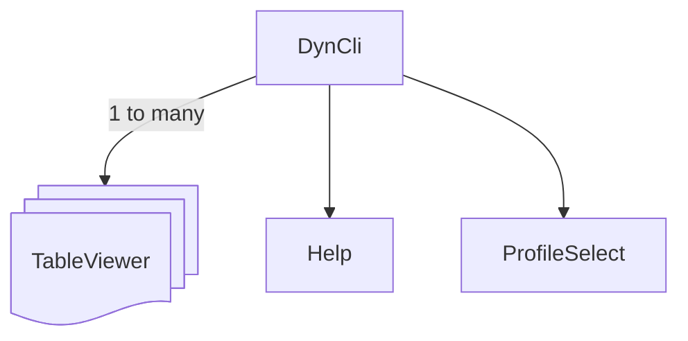
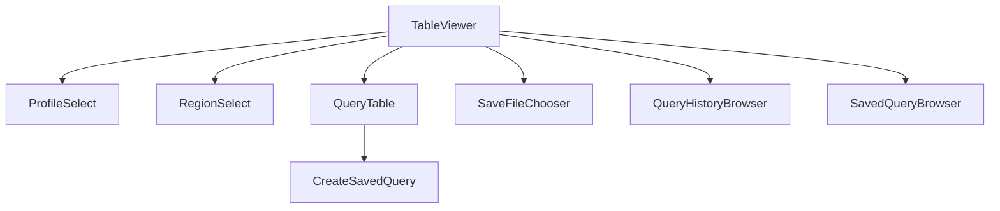
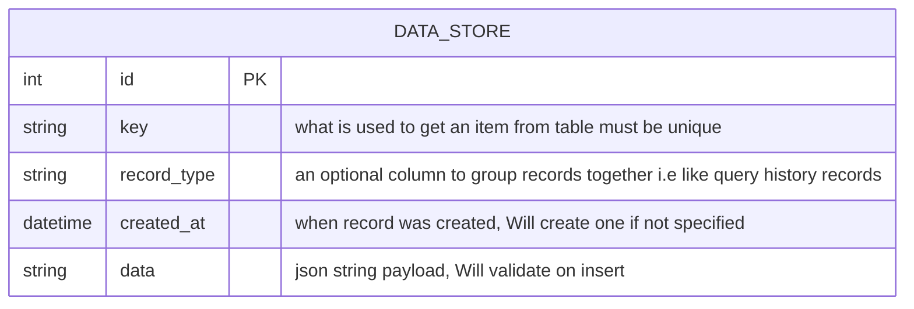

# Architecture

## Overview

This document will give an overview of how the application is structured and the reasons why. There are 3 core parts to this app: the app screen (`DynCli`),  `TableViewer` screen and database layer for saving query history and saved queries

## The app screen (entry point of app)


I have gone though a few iterations but have landed on using the app class (i.e DynCli) managing multiple screens of TableViewer which that screen will do all the heavy lifting of selecting the aws profile, getting the table, querying the data etc. Therefore that means you can have multiple TableViewer screen which are pointing to different aws accounts as that data is isolated to the screen. 

By default when app is loaded it will create a default one or (still to be done) will load up an existing set of TableViewer screens. This was one of the most annoying things with the aws Dynamodb console is it would never save where you left off so i wanted to ensure this app supports it

## TableViewer screen



As said above this is where the core logic of the app is i.e this is where you select what table you want to query, what aws account you want to use etc. To do those actions there are a set of pop up screens that will do that functionality i did that so there isn't any shared data state across screens which i had in one iteration of this and it was a pain to manage.

### ProfileSelect

This screen will get the local aws profiles and allow you to select one and once selected will update table data or display nothing if table isn't found in aws environment

### RegionSelect

Will allow you to select what aws region to be on

### QueryTable 

This screen will allow you to query the table via Dyanmodb query or scans which will get displayed on TableViewer this done via a pydantic model that will output dynamodb boto query/scan sdk parameters. It will also will allow you to save that query via the `CreateSavedQuery` screen (In future this should also be supported on the TableViewer screen) 

### SaveFileChooser

This will allow you to save the query result to a json or csv file

### QueryHistoryBrowser

This will show the query history and allow you to select previous ran queries and delete them with eventual support for filtering queries by date etc

### SavedQueryBrowser 

Similar to `QueryHistoryBrowser` this will show saved queries allow you to search by filters (right now only name is supported) and deleting or renaming a saved query

## Database layer

Like the other parts went though a few iterations but have now gone with using sqlite primarily because python has inbuilt support for it, Its very flexible and allows for concurrent writes and reads which can happen in this app. 

### table structure

As the data is never going to be massive i decided to go with a custom key value storage where the value is always a json payload with a couple of other useful columns for filtering of data. Sqlite has really good support for json so it made sense to go down this way the table is structured like this:



This then allows for future changes without needing a database migration and all the setup you need to do for that, Which is overkill as right now we really only have two different type of items that we want to store in the database and can change in future if necessary. The benefit of sqlite is that it can just be a new file and you can still keep the old data for backwards compatibility etc  

#### Usage example  

So to insert a item into the database its as simple as: 

```sql
INSERT INTO data_store (key, data) ('some_key', '{"test": 1, "name": "barry"}')
-- using the record_type for easier filtering
INSERT INTO data_store (key, record_type, data) ('some_key_2', 'TestItem', '{"test": 2, "name": "bob"}')
-- passing in your own created_at timestamp
INSERT INTO data_store (key, record_type, created_at data) ('some_key_3', 'TestItem', '2026-01-25T05:19:35+00:00', '{"test": 3, "name": "boby"}')
```
then to filter you do:

```sql
-- filter on a json key value
SELECT data WHERE json_extract(data, '$.name') = 'barry'
-- filter on json key value and record type 
SELECT data WHERE json_extract(data, '$.name') = 'barry' AND record_type = 'TestItem'
```

update:

```sql
-- will update or add
UPDATE data_store SET data = json_set(data, $.test, 6) WHERE key = 'some_key'
```

and delete:
```sql
DELETE FROM data_store WHERE key = 'some_key'
```
